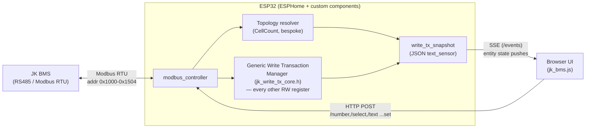
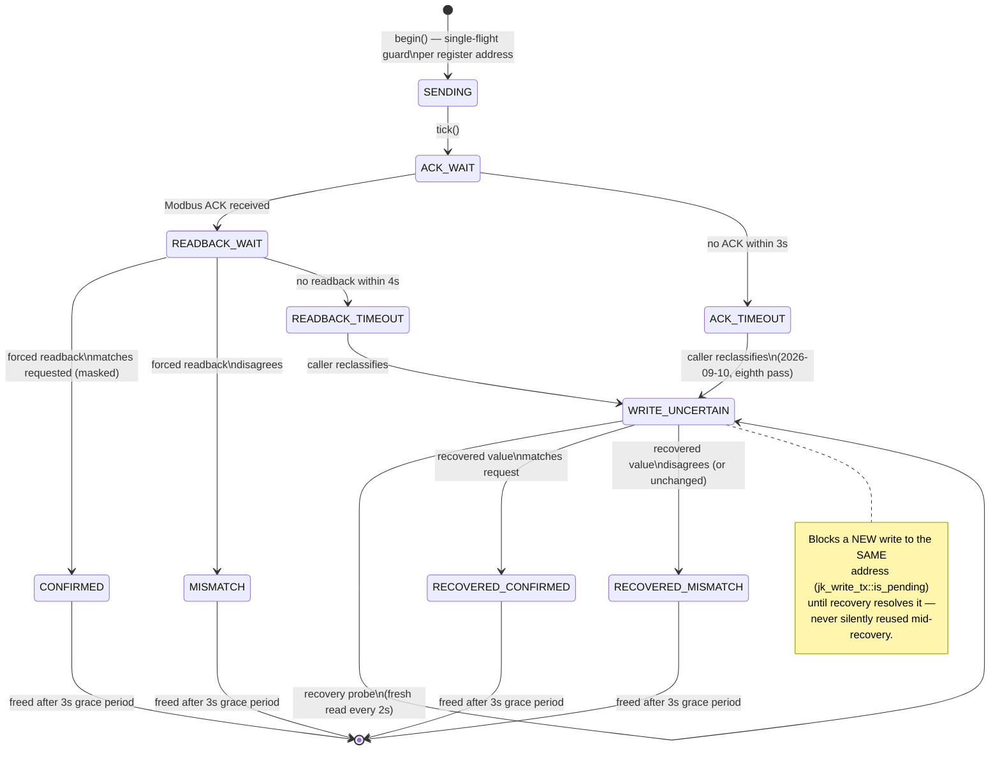
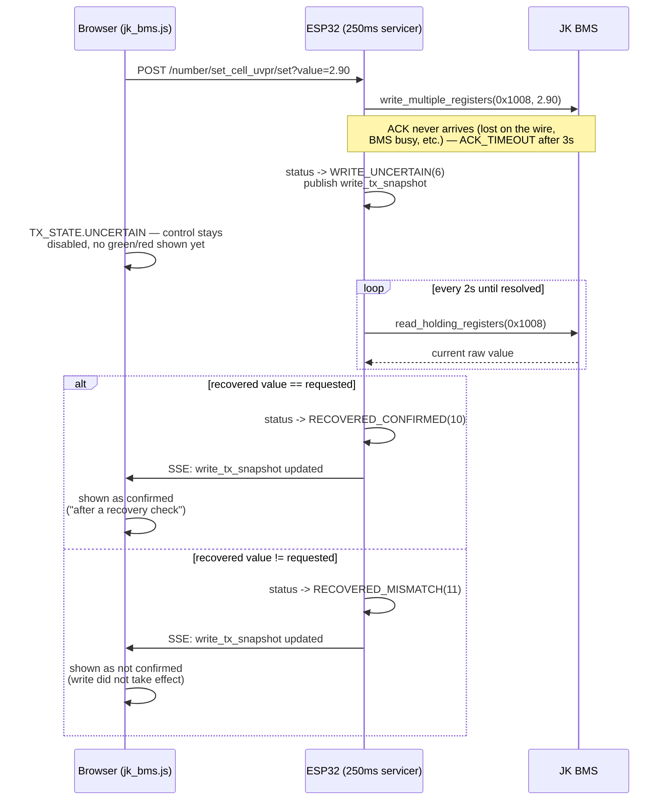
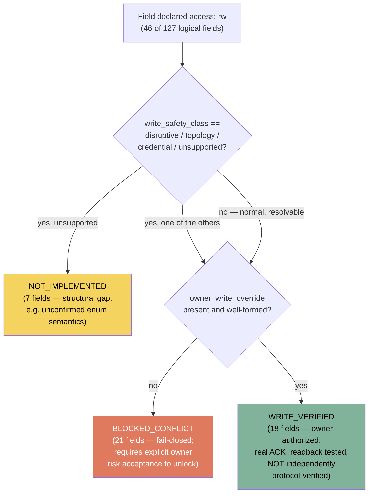

# Architecture overview — diagrams

Visual companion to `docs/adr/0001-protocol-catalog.md` (the full decision
record). This file covers the two pieces of the system that are hardest to
follow from code alone: the system's overall data flow, and the generic
Write Transaction Manager's state machine (including the WRITE_UNCERTAIN
recovery path added in the ADR's eighth-pass addendum). It does not restate
the ADR's own reasoning — see that file for *why* each decision was made,
including the safety invariants and what remains unverified against real
hardware.

## 1. System data flow

`register_catalog.json` and `protocol/registers.canonical.json` are the
single source of truth both the firmware (`batterylifepo4.yaml`) and the
browser UI (`jk_bms.js`) are generated/validated against — see
`tools/protocol/generate.js` and the ADR's "Decision" section for the full
pipeline.

## 2. Generic write transaction — state machine

Every RW register **except** CellCount (which keeps its own, older,
separately-tested bespoke driver — see the ADR's Context section) goes
through `jk_write_tx_core.h`'s state machine. States 0–5, 7–9 are emitted
by `tick()` itself; `WRITE_UNCERTAIN`(6) and the two `RECOVERED_*` states
(10, 11) are never emitted by `tick()` — they are applied by the *caller*
(`batterylifepo4.yaml`'s 250ms servicer) as a recovery layer on top of the
same numeric status-code space, mirroring how CellCount's own bespoke
driver already folds its timeouts into `WRITE_UNCERTAIN`.

A second write to an address already in `SENDING`/`ACK_WAIT`/
`READBACK_WAIT`/`WRITE_UNCERTAIN` is rejected outright (`REJECTED`, status
9) rather than queued or allowed to race — see `begin()` in
`jk_write_tx_core.h`.

## 3. Why WRITE_UNCERTAIN exists: the two outcomes a timeout can hide

An ACK or forced-readback timeout is ambiguous by itself — the write may
have silently taken effect on the BMS even though its acknowledgement
never reached the ESP32. Reporting a plain "error" at that point would
either produce a false negative (user thinks the write failed, it didn't)
or, if treated as an optimistic success, a false positive. The recovery
probe removes the ambiguity by re-reading the register independently:

## 4. RW field access classification

`registers.canonical.json` is the only place this decision is made. Every
field the protocol declares `access: "rw"` lands in exactly one bucket —
see `RW_REGISTER_VERIFICATION_MATRIX.md` for the full, generated table.

`owner_write_override` is **risk acceptance, not protocol verification** —
see the ADR's fourth-pass addendum for exactly what that distinction means
and why it matters. No field currently carries `verification_status:
"confirmed"`.
